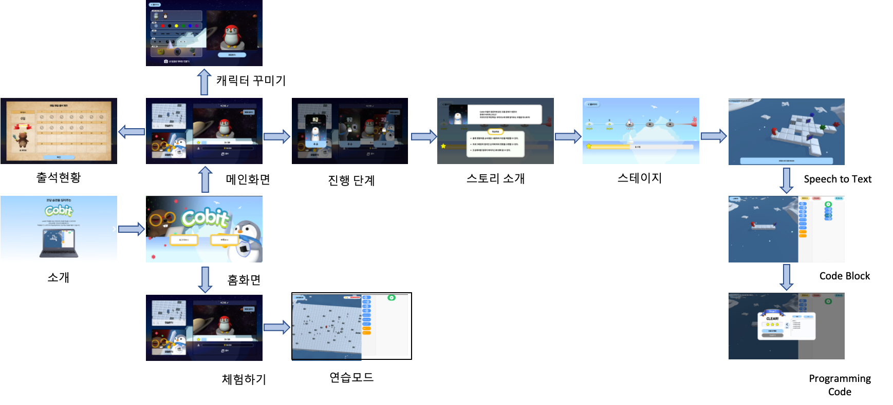

# **:desktop_computer: Co:bit ( Coding + Habit )**

> 코딩 습관을 기르자

- #### 팀명(B102) :nose:

  **코쿠멍** : :door: 코딩의 문을 열기위한 열쇠 구멍 :key:  

- #### 팀원 소개

  팀장 : **김낙현**(BE)

  팀원 : **권남선**(FE), **류혜명**(FE), **박건호**(BE), **박종준**(FE)

- #### 역할

  - `Tech Leader` - 김낙현
  - `QA` - 권남선
  - `개발자` - 박건호
  - `기획자` - 박종준
  - `디자이너` - 류혜명

## **:baby_chick: 주제**

- **웹 기반 코딩 교육 플랫폼**
  - 코딩 게임으로 논리적 컴퓨팅 사고를 즐겁게 배우는 교육 플랫폼

## **:penguin: 기술스택**

- Frontend

  Vue.js, Vuetify, Unity

- Backend

  Spring

- AI

  google cloud vision api, STT

## **:monkey_face: 기능**

- **로그인 / 회원가입**
- **단계**
- **코딩 모험 - 스토리**
  - 미션
    - 미션 해결 방법
      1. STT(Speech To Text)
         - 생각한 것을 실행하기
           - 성공시 : 다음 단계
           - 실패시 : 다시 말하기
      2. 코딩 블록
         - 코딩 블록 작성 후 실행하기
           - 성공시 : 코드화 / 별 1~3개
           - 실패시 : 다시하기
  - 자유 필드
    - 모든 기능 다 가능
  - 모션 인식
    - 자신의 얼굴로 된 캐릭터 > 캐릭터화
    - 나만의 캐릭터 만들기
    - 나의 행동을 모사하는 캐릭터
    - 캐릭터와 함께 사진찍기

## **:full_moon: 화면 구성**




## **🍎 개발규칙**

### **공통**

- 특수문자는 _ 만 허용한다.
- ex) Is_Select(클래스), get_Value(함수), is_Select(변수)

### **클래스명**

- 클래스명은 대문자의 명사로 시작한다.
- ex) IsSelect

### **함수명**

- 소문자의 동사로 시작한다.
- ex) getValue

### **변수명**

- 소문자로 시작하며 여러 단어로 이루어진 경우 각 단어의 첫글자를 대문자로 한다.(카멜표기법)
- ex) isSelect

## **⭐️ Git 규칙**

**branch**

```
master -> develop -> feature/fe or feature/be or feature/unity
```

**merge**

```
- 코딩하기 전 develop 가져오기
git checkout develop 
git pull origin develop

- merge 하기 전 서로 코드 리뷰하기
- merge 후 branch 지우기
```

**commit**

```
1 day 1 commit
커밋 메시지는 => 이슈번호 /(Add/Updata/Delete) 작업 내용 <= 의 구조로 작성
ex) S123301 /Add Login
이슈번호가 없을경우 None 으로 대체
```