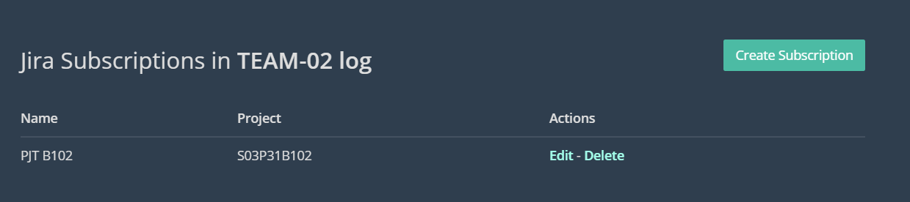
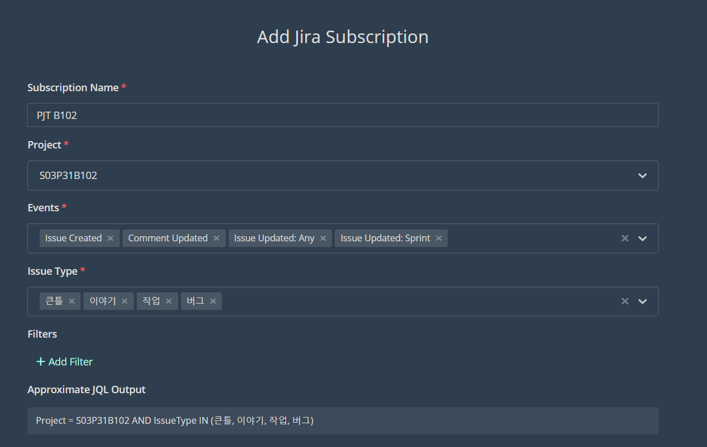

# JIRA 연동법

1. TEAM-02 log 채널로 이동
2. **/jira subscribe** 채팅입력
3. Create Subscription 클릭

    

    - Subscription Name : PJT B102
    - Project : S03P31B102 선택
    - Events
        - Issue Created
        - Comment Updated
        - Issue Update:Any
        - Issue Update:Sprint
    - Issue Type
        - 큰틀, 이야기, 작업, 버그

    

4. Set Subscriptoin 클릭
5. 채널 알림 끄기